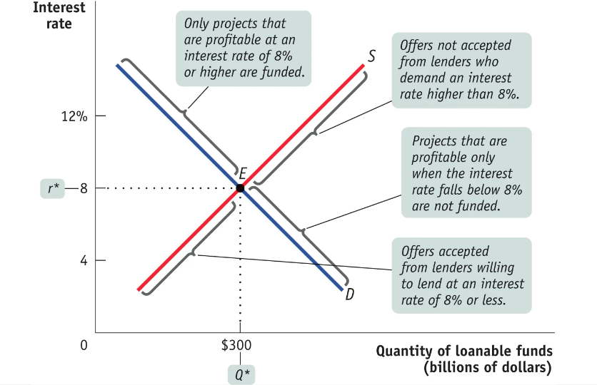

# Chapter 10
## Savings, Investment Spending, and the Financial System

### Matching Up Savings and Investment Spending

```{admonition} Public investment spending vs. Private investment spending
Physical capital is mainly created by private investment spending, such as individuals and companies.

Exceptions such as infrastructure are created by public investment spending (government).
```

**Savings-investment spending identity**<br>
Savings and investment spending are always equal for the economy as a whole.<br><br>

```{admonition} In a closed economy
$I = S_{\text{National}} = S_{\text{Private}} + S_{\text{Public}}$<br>
where $I = $ investment and $ S_{\text{National}} = $ national savings
```

In economics, investment means buying physical capital, not financial investments (in bonds, stocks).<br><br>

**Private savings**<br>
Savings by households.

$S_{\text{Private}} = (GDP - T + TR) - C$<br>
where<br>$S_{\text{Private}} = $ private savings<br>$T = $ taxes<br>$TR = $ $transfers from government

**Public savings**<br>
Savings by the government.

**Budget balance**<br>
Difference between tax revenue and government spending.<br><br>
Budget surplus means tax revenue $>$ government spending.<br><br>Budget deficit means tax revenue $<$ government spending.

```{admonition} In an open economy
$NFI = X - IM = \text{Net exports}$<br>
$S_{National} = I + (X - IM) = I + NFI$<br>
National savings = Investment + Net foreign investment
```

**Loanable funds market**<br>
Matches savers to borrowers.

**Equilibrium interest rate**<br>


(Outward or Inward) shifts of the domestic demand for loanable funds
- Changes in perceived business opportunities.
- Changes in government policies that affect investment.

(Outward or Inward) shifts of the domestic supply for loanable funds
- Changes in private savings behaviour.
- Changes in government budget balance.

```{admonition} Global loanable funds market
Some countries with a lower interest rate export their excess savings to borrowers in other countries with a higher interest rate.<br><br>
These exports of savings are matched to imports by an equilibrium interest rate for the world as a whole that equalizes interest rates across countries.
```

```{admonition} Inflation and interest rates
Real interest rate = Nominal interest rate - Inflation rate

Inflation rate does **NOT** affect real interest rate, but does affect nominal interest rate.

**Fisher effect**<br>
Higher expected future inflation raises the nominal interest rate.
```

### The Financial System

- Financial markets are where households can invest their current savings or their wealth by purchasing either financial assets or physical assets. A financial asset is a seller's liability.
- A well-functioning financial system reduces transaction costs, reduces financial risk by enabling diversification, and provides liquid assets, which investors prefer to illiquid assets.
- The four main types of financial assets are loans, bonds, stocks, and bank deposits. A recent innovation is loan-backed securities, which are more liquid and more diversified than individual loans. Bonds with a higher default risk typically must pay a higher interest rate.
- The most important types of financial intermediaries are mutual funds, pension funds, life insurance companies, and banks.
- A bank accepts bank deposits, which obliges it to return depositors' cash on demand, and lends those funds to borrowers for long lengths of time.

### Financial Fluctuations

- Financial market fluctuations can be a source of short-run macroeconomic instability.
- A financial asset allows higher future consumption:
    - Financial assets provide regular income.
    - Investors can sell the asset at a profit in the future.
- Asset prices are driven by supply and demand as well as by the desirability of competing assets like bonds. Supply and demand also reflect expectations about future asset prices. One view of expectations is the **efficient markets hypothesis**, which leads to the view that stock prices follow a **random walk**.<br>
- Market participants and some economists question the efficient markets hypothesis. In practice, policy makers don't assume that they can outsmart the market, but they also don't assume that markets will always behave rationally.